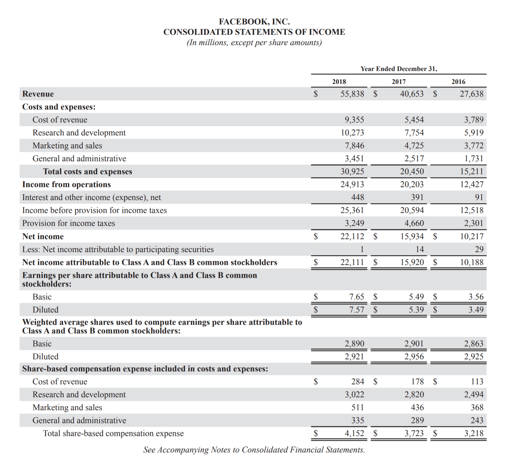

# FINANCIAL ANALYSIS FACEBOOK
**Lam Nguyen**

# COMPANY PROFILE

Facebook is a must-know corporation of the 21st century. It was incorporated on July 24, 2004, and founded by Mark Zuckerberg, its current CEO. Since then, it has successfully expanded from solely a social media platform to a corporation covering many pioneering technological fields. Its mission of “giving people the power to build community and bring the world closer together” has been tirelessly upheld by providing people with products that strengthen their community connections and acknowledgment of the world. Facebook products include Facebook, Instagram, Messenger, WhatsApp, Oculus, and it is working on further advancement in AI, AR, and connectivity. Noticing some remarkable financial milestones from Facebook: in 2009, its cash flow was claimed to turn positive for the very first time; then 3 years later, in 2012, it officially goes public at the initial public offering of 38$ a share, with the company evaluation of $104 billion. Back in 2012, $104 billion evaluation had marked Facebook’s name as the greatest evaluated business that had just gone public. The power of Facebook was even further enhanced with its Q1 2016 financial report of a 57% increase in advertising revenue, leading its share price to rocket and knocking all the previous predictions. By now, 2019, its stock price exchange is now 187.89$ after 7 years. By selling advertisements, continuously innovating and expanding to long-term technological initiatives, Facebook is now the giant competitor to many other giants in various fields such as Google, Youtube, Amazon, etc. Being considered as a healthy business with promising financial figures, a considerable technology giant, Facebook auspiciously has the potential of nailing down every race it enters.

# FINANCIAL STATEMENT

Percentage change between 2017 and 2018 in:
Sales: 37.35%
Cash: 24.01%
Cost of sales (COGS): 71.53%
Total current assets: 3.95%
Total assets: 15.16%
Total current liabilities: 86.62%
Total liabilities: 29.97%
Total equity: 13.15%
Net Income (Loss): 38.77%

Excel Sheet: https://rb.gy/qia8hc

**2018**
* Current Ratio/Liquidity = Current AssetsCurrent Liability = 50,4807,017 = 7.19
* Return on Equity = Net IncomeShareholders' Equity = 22,11284,127 = 0.26 (26.28%)
* Debt to Equity Ratio = Total Liabilities (Debt)Total Equity = 084,127 = 0.00
* Return on Assets = Net IncomeAverage Total Assets = 22,112(97,334 + 84,524) / 2 = 0.24$ (24.31%)
* Profit Margin = Net IncomeNet Sales = 22,11255,838 - 9,355 = 0.48$
2017

**2019**
* Current Ratio/Liquidity = Current AssetsCurrent Liability = 48,5633,760 = 12.91
* Return on Equity = Net IncomeShareholders' Equity = 15,93474,347 = 0.21$ (21.43%)
* Debt to Equity Ratio = Total Liabilities (Debt)Total Equity = 074,347 = 0.00
* Return on Assets = Net IncomeAverage Total Assets = 15,934(97,334 + 84,524) / 2 = 0.18$ (17.5%)
* Profit Margin = Net IncomeNet Sales = 15,93440,653-5,454 = 0.45$ (45.26%)

# INTERPRETIVE ANALYSIS

7.19 liquidity may seem high, which means, as said, too much cash, but comparing to its performance in 2017, Facebook actually did a really nice try to remarkably reduce it from 12.92 to 7.19. Such reduction can be put down to its effort in boosting investment in continuous technology innovation including hardware products, long-standing initiatives, etc. To be said, Facebook is considerably using its assets and money on more areas. With the current strategy and liquidity rate, the company will be able to do much more and develop even more in the future.

Meanwhile, 45% is actually considered a high profit margin. With such impressive figures, Facebook is proved to be operating efficiently, producing its services and products at a lower cost and generating higher profits. In the short-run, it helps preventing the business from hardships with debts, expenses and owners’ income handling. In the long-run, the possible benefits are confident. By running effectively, it will gain a competitive edge in the price war, which can later act as a stable base for future profitability and promising actual income rise. Simultaneously, the more profit it generates, the more attractive the business is to investors, which then gives it even more opportunities in expanding and developing the business.

Regarding the debt-to-equity ratio, 0 is a really impressive number, but it isn't of a firm ground to conclude that this is a greatly healthy business. In the short-term, or specifically in the rise and continuous development of Facebook, it proves confidentially strong benefits expectations, because the risk is much less, considerably 0, and the additional capital stimulatingly grows. However, there is still a concern from the long-term performance. The concern is that every business experiences rise and fall, and in such falls, the financial leverage from debt/loan gives the investors better protection, which Facebook can not offer now due to its impressive 0. At such point, investors may consider withdrawing/stopping their investment, which can be a problem then.

# REFERENCES
1. “Facebook Annual Report 2018”. Facebook Investor Relations, 31 December 2018, https://s21.q4cdn.com/399680738/files/doc_financials/annual_reports/2018-Annual-Report.pdf
2. “Facebook ‘cash flow positive’, signs 300M users”. CBC News, 16 September 2009, https://www.cbc.ca/news/technology/facebook-cash-flow-positive-signs-300m-users-1.826223
3. Caulfield, Brain. “Facebook IPO: Time For A Drink”. Forbes, 17 May 2012, https://www.forbes.com/sites/briancaulfield/2012/05/17/facebook-goes-public-time-for-a-drink/#7336efce3dfa
4. Seetharaman, Deepa. “Facebook Revenue Soars on Ad Growth”. The Wall Street Journal, 28 April 2016, https://www.wsj.com/articles/facebook-revenue-soars-on-ad-growth-1461787856

